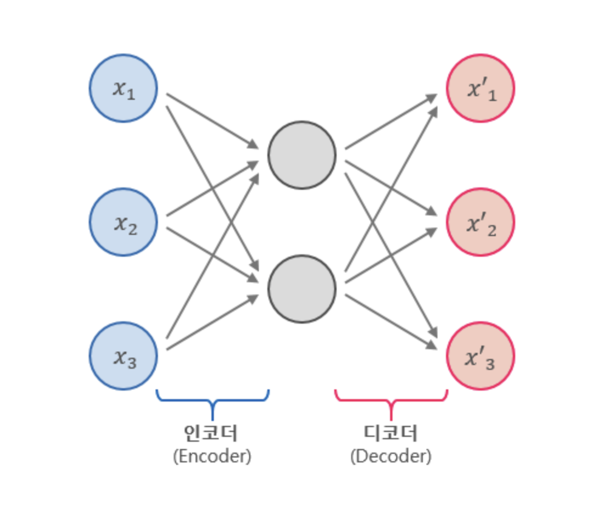

Auto Encoder Mnist Example
============
* 이미지 손 글씨 숫자 데이터 예제 
* 기본 28x28 이미지 데이터
* Auto Encoder를 이용하여 기존 이미지와 같은 이미지를 생성 함으로써 
이미지 Feature의 특징을 추출할 수 있고, 
이를 통해서 분류, 생성, Anomaly Detection 등을 하는데 사용가능
* Auto Encoder는 unsupervised learning

## Auto Encoder

* 인코더와 디코드를 거치면서 이미지의 정보의 Noise를 제거하고, 특징을 뽑아냄
* 원본 이미지와 가깝다면 이미지 Feature를 잘 뽑아냈다고 할 수 있음
* **"AutoEncoder_Example.py"** 예제에서 3가지 Mode에 AutoEncoder를 사용할 수 있음
    1. mode='SAE' -> Stacked Auto Encoder
    2. mode='DAE' -> Denoising Auto Encoder
    3. mode='VAE' -> Variational Auto Encoder

<pre>
cd '현재디렉토리'
-> Stacked Auto Encoder
python AutoEncoder_Example.py --mode=='SAE' 

-> Denoising Auto Encoder
python AutoEncoder_Example.py --mode=='DAE' 

-> Variational Auto Encoder
python AutoEncoder_Example.py --mode=='VAE' 
</pre>

### Auto Encoder 참고 사이트
* [Auto Encoder EXCELSIOR](https://excelsior-cjh.tistory.com/187)
  