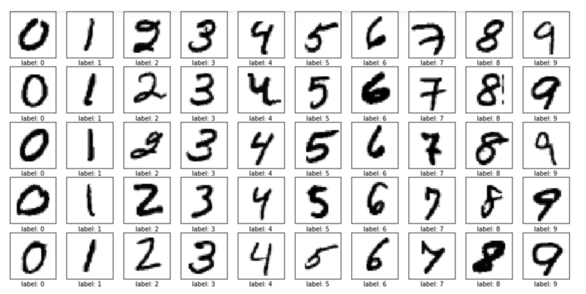

Tensorflow 2.0 version Mnist 예제 
=============
1. Tensorflow 2.0버전부터 케라스를 지원하고 있어, 기존 Tensorflow예제를 2.0으로 실행하기 위해서 많은 변화가 있음. 따라서 기존 예제에서 Keras와 Tensorflow 모두를 활용한 Tensorflow 2.0를 만드는 것을 목표로 하고, 2.0에서 Tensorflow 를 쉽게접근하도록 하는 것이 목표.

2. 물론 2.0부터 복잡하고 어려운 Tensorflow보다 Keras를 사용하기를 권장하는 것이 구글의 목표이긴함. 하지만 복작한 만큼 내가 원하는 코드를 만들거나 실험하기는 Tensorflow를 더 적당하고 판담됨

3. 예제 코드를 보면 알겠지만, Keras가 훨씬 모델을 만드는데 간결함

4. 개인적으로 차후, 최신 논문의 Network를 구현하기 위해서 Keras와 Tensorflow를 모두 다시 공부하고, 2개 모두 코드로 구현하여 다양한 연구자들이 사용할 수 있었으면 하는 바램

5. Keras와 Tensorflow를 모두 비교하고, 모두 쉽게 사용하길

# Mnist Data
이미지 손 글씨 숫자 데이터 예제 
기본 28x28 이미지 데이터

# Tensorflow Version
tensorflow ==2.0

# Env 설정
* Ancoda Env가정(Teminal환)
    * conda create --name mnist python=3.6
    * pip install requirments.txt
        * Tensorflow 설치가 안된다면 -> pip install tensorflow==2.0
        * 2.1보다 2.0이 윈도우실행시 문제가 없다고 판단됨 
        * 2.1을 설치하여도 무리없이 동작함
    * code실행
    
